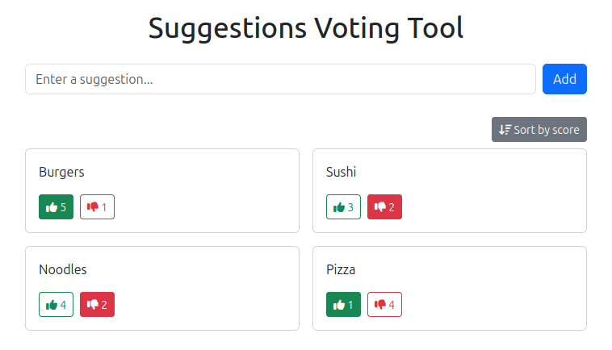

# NoteVote

NoteVote is a lightweight tool for collecting suggestions and voting on them. Users submit short text notes and cast upvotes or downvotes on notes submitted by others.

## How it works

- **Anonymous note submission:** submitted notes are not tied to user identities
- **Anonymous voting:** votes are not tied to user identities. Each vote is recorded as an independent transaction with a unique, randomly generated ID.
- **Client-side state recovery:** the server never tracks who voted on what. Instead, each client stores the transaction IDs it created (e.g. in local storage). To restore its voting state (after a page reload, for example), the client sends its known transaction IDs to the server, which reports which notes those transactions correspond to.
- **Changing a vote:** to change or retract a vote, the client submits a new transaction referencing the ID of the one it replaces. The server invalidates the old transaction and updates the note's tally accordingly.
- **Access control:** the board is reachable only via a secret URL path. Requests to any other path are rejected.
- **Live updates:** connected clients receive new notes and vote tallies in real time over a WebSocket.

## Limitations

### Anonymity

- A malicious server operator could still attempt to de-anonymize users through side channels such as request timing, IP addresses, or patterns observed in state-recovery requests (which reveal a client's full set of past transaction IDs at once).

### Integrity

- If a user loses their locally stored transaction IDs (e.g. by switching devices, clearing storage, or a browser reset), the server has no way to recognize their prior votes, which may allow duplicate voting.
- A malicious server operator could tamper with stored transactions or delete notes and their associated votes, since the server is the sole source of truth and there is no client-side verification of history integrity.
